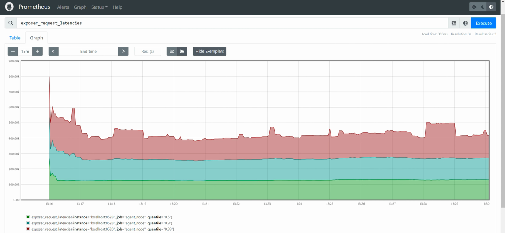
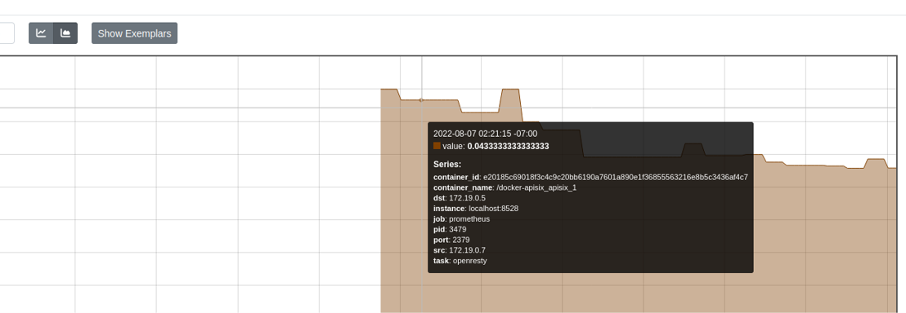
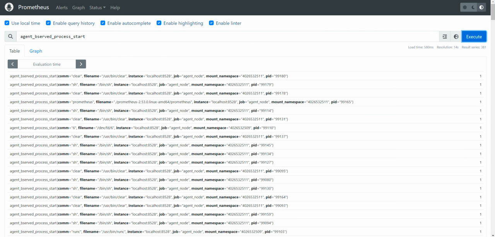
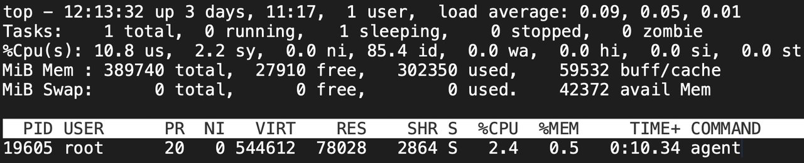
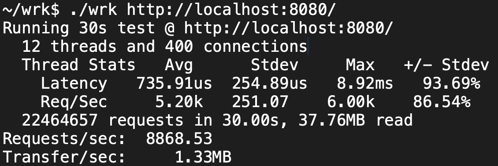
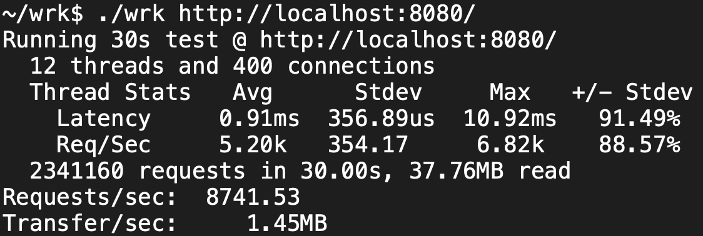

# 基于eBPF的容器异常检测Agent

## 简介

Agent是一个基于eBPF技术的容器异常检测框架，旨在通过收集容器的行为特征和指标特征，利用人工智能算法自动识别具有异常行为的容器。

Agent 使用 Linux eBPF 技术在运行时监控系统和应用程序，分析收集的数据以检测可疑行为。它具备性能分析、容器集群网络可视化、容器安全警报、一键部署和持久化存储监控等功能，支持多种 eBPF 追踪点，且易于扩展。核心导出器和命令行工具的二进制程序最小仅需约 4MB，能够在支持的 Linux 内核上运行。

在企业生产环境中应用Agent项目，可以提升系统安全性和可靠性，优化性能，简化运维管理，并增强合规性，通过实时监控、自动化异常检测和详细审计日志，帮助企业及时发现和处理安全威胁，优化资源配置，降低运维成本，确保符合行业标准和法规。

## 技术说明

团队长期聚焦在终端异常检测方向，具备一定技术积累。本项目使用到的异常检测方法是基于终端自适应画像的异常检测技术在容器工作负载和eBPF采集技术上的扩展，该技术目前已适配linux和windows平台，相关成果发表在领域顶级会议。首先从工业界实际场景应用的角度识别出现有异常检测工具客户端占用高、告警数量和图规模难以平衡以及服务端内存占用高的三大技术瓶颈，该工作发表在ACM CCS 2023[1]（CCF-A类 信息安全顶级会议）。其次，团队在国际上首次提出通过分布式架构设计，解决了终端溯源图检测成本高的难题，系统中有机结合了全局模型、告警聚合、告警语义相似和告警打分和大模型等方法的告警过滤方法，突破了异常检测方法面临的告警疲劳问题，该工作发表在USENIX Security 2023[2]（CCF-A类 信息安全顶级会议）和NDSS 2024[3]（CCF-A类 信息安全顶级会议）.

基于终端自适应画像的异常检测技术不仅获得学术界认可，也在实际场景中得到广泛的应用，产生较大价值。原型系统在1130台实验室终端集群上检测效果不低于现有方法的情况下，检测成本降低56倍，在某企业2w+台终端上检测出900+真实攻击。告警降噪技术在国内某头部家电和某头部物流企业真实告警数据上达到95%以上的降噪率和99%以上的降噪准确率。相关技术以《基于自适应画像的异构终端安全检测技术》入选华为OpenHarmony TSC年度课题，并进行汇报。

[1] Are we there yet? An Industrial Viewpoint on Provenance-based Endpoint Detection and Response Tools[C]. The 30th ACM Conference on Computer and Communications Security (CCS) (ACM CCS 2023, CCF-A 信息安全四大顶会)

[2] DISTDET: A Cost-Effective Distributed Cyber Threat Detection System[C]. Proceedings of The 32th USENIX Security Symposium (USENIX Security 2023, CCF-A 信息安全四大顶会)

[3] NODLINK: An Online System for Fine-Grained APT Attack Detection and Investigation Network and Distributed System Security (NDSS) Symposium 2024(NDSS 2024, CCF-A 信息安全四大顶会)

## 目的

Agent项目的目标是解决容器环境中常见的性能不稳定、系统崩溃和安全问题。通过高效的数据采集和准确的异常检测算法。同时，Agent还可以帮助开发者和运维人员迅速识别和处理容器异常事件。
- 提升系统安全性：通过实时监控和检测容器内的异常行为，有效预防和应对潜在的安全威胁。
- 优化系统性能：通过分析容器的性能指标，帮助企业识别并解决性能瓶颈，提升整体系统效率。
- 简化运维管理：提供一键部署和远程控制功能，大幅简化容器化环境的运维工作，降低运维成本。

## 使用场景

Agent适用于以下使用场景：
- 大规模容器化应用的监控和异常检测
- 云计算环境中的容器安全管理
- 容器化开发环境的性能调优和故障排查

## 功能列表

- 开箱即用：通过单一二进制文件或镜像分发，一次编译，到处运行。启动简单，包含多种 eBPF 工具和监测点，支持多种输出格式（json, csv等），并可保存到文件。
- 自动化元信息收集：通过 eBPF 自动收集容器相关元信息，并结合多种指标。
- 监控集成：支持集成 Prometheus 和 Grafana，提供监控可视化和预警平台；也可作为 OpenTelemetry 的 collector 使用。
- 自定义预警规则：可配置运行时安全预警规则，通过 Prometheus 实现监控告警。
- 进程行为收集：自动收集进程行为，并通过 seccomp/capability 进行限制。
- 远程控制：提供 HTTP API，实现 eBPF 跟踪器的热插拔、一键分发和热更新，可定制插件进行数据分析。
- 高度可扩展：核心框架易于集成其他 libbpf eBPF C 程序。
## 技术栈

Agent项目使用了以下技术、框架和库：
- Linux eBPF
- Grafana
- Python/Go（用于数据处理和算法实现）
- Docker/Kubernetes（用于容器环境）

## 安装编译指南

### 配置要求

在编译之前，确保您的 Kconfig 包含以下选项：
```
CONFIG_DEBUG_INFO_BTF=y 
CONFIG_DEBUG_INFO=y
```
建议的内核版本为 5.10 或更高。如果使用较旧的内核版本，可能需要安装额外的 BTF 信息。
### 使用预编译的二进制文件

您可以使用我们预编译的二进制文件（请参见最新发布版本）来启动 Agent 服务器：
```
sudo ./agent server
```
此命令将启用核心 eBPF 跟踪器，包括进程、TCP 和文件，同时启动安全引擎以检测潜在的安全问题。

您也可以使用 Agent 运行单个 eBPF 跟踪器，例如：
```
sudo ./agent run files
```
该命令将在默认间隔 3 秒内跟踪系统中所有文件的读取或写入，并输出结果：
```
[2024-08-02 14:15:11.688] [info] start agent...
[2024-08-02 14:15:11.688] [info] start ebpf tracker...
[2024-08-02 14:15:11.688] [info] start prometheus server...
[2024-08-02 14:15:11.688] [info] press 'Ctrl C' key to exit...
[2024-08-04 16:22:30.123] [info] pid    container_name reads  writes read_bytes write_bytes type   comm         filename
[2024-08-04 16:22:30.123] [info] 142326 ubuntu          0      1          0          1      R      postgres     oom_score_adj
[2024-08-04 16:22:30.123] [info]   5824 ubuntu          1      0         16          0      R      code         state.vscdb
[2024-08-04 16:22:30.123] [info]   5453 ubuntu          1      0         16          0      R      grafana-server grafana.db
[2024-08-04 16:22:30.123] [info] 142327 ubuntu          1      0         18          0      R      git          .gitignore
[2024-08-04 16:22:30.123] [info] 142327 ubuntu          1      0         18          0      R      git          .gitignore
[2024-08-04 16:22:30.123] [info] 142327 ubuntu          1      0         18          0      R      git          .gitignore
[2024-08-04 16:22:30.123] [info]   5824 ubuntu          1      1          8         12      R      code         state.vscdb-journal
```
### 在Linux上编译

请按照以下步骤安装和设置Agent项目：
1. 克隆仓库：

```
# 使用docker进行部署
docker build -t agent-test .
docker run -it --rm agent-test /bin/bash

# code init
git clone https://gitlink.org.cn/p4zt3ZfhkI/jyedrqycjc.git && cd jyedrqycjc
git submodule update --init --recursive

# gitlink的子模块貌似无法更新 请自行去子目录更新
```
2. 编译部署Agent：

```
# dependencies
make install-deps

# bpf headers
make generate-tools

# cmake configure
CC=gcc-10 CXX=g++-10 cmake -Bbuild -Dagent_ENABLE_UNIT_TESTING=0 -Dagent_USE_GTEST=0

# 首先创建一个名为 build/libbpf/ 的目录，然后将 bpftools/process/.output/libbpf/ 目录中的 libbpf.a 文件复制到新创建的目录中
mkdir -p build/libbpf/ && cp bpftools/process/.output/libbpf/libbpf.a build/libbpf/libbpf.a

# 在指定的 build 目录中构建项目
cmake --build build --config Release
```
### 使用 Docker 部署 Prometheus 和 Grafana

#### 快速启动

1. 构建并运行Agent Docker镜像：
```
sudo docker build -t agent:v0.1 .
sudo docker run agent:v0.1
```
#### 部署 Prometheus
1. 拉取 Prometheus 镜像：
```
sudo docker pull prom/prometheus
```
2. 配置 Prometheus：
```
cp ./prometheus.yml /etc/prometheus/prometheus.yml
```
3. 运行 Prometheus 容器：
```
sudo docker run -d --user root -p 9090:9090 -v /etc/prometheus/prometheus.yml:/etc/prometheus/prometheus.yml -v /etc/prometheus/data:/data/prometheus prom/prometheus --config.file="/etc/prometheus/prometheus.yml" --web.listen-address="0.0.0.0:9090"
```
#### 部署 Grafana

1. 拉取 Grafana 镜像：
```
sudo docker pull grafana/grafana:latest
```
2. 运行 Grafana 容器：
```
sudo docker run -d -p 3000:3000 --name=grafana grafana/grafana:latest
# or on ubuntu
sudo apt-get install -y adduser libfontconfig1
wget https://dl.grafana.com/enterprise/release/grafana-enterprise_8.5.4_amd64.deb
sudo dpkg -i grafana-enterprise_8.5.4_amd64.deb
sudo /bin/systemctl start grafana-server
```
### Prometheus和Grafana运行结果

在 Promtheus 上展示和容器信息关联的 tcp 连接延时


对于容器中进程的跟踪结果，记录开始和结束时间

grafana dashboard: tcp files syscall 每分钟计数统计图


## 设计文档

[系统框架与ebpf探针设计](docs/系统框架与ebpf探针设计.pdf)

[容器追踪模块设计](docs/容器追踪模块设计.pdf)

## 兼容性

Agent支持以下操作系统和环境：
- Linux
- Docker/Kubernetes

## 依赖关系

项目运行所需的依赖项包括：
- Linux内核版本 >= 4.18（支持eBPF）
- Python/Go（用于算法实现）
- Prometheus/Grafana（用于数据展示）

## Benchmark

为了评估Agent的性能，我们使用了以下基准测试方法：

### 使用 top 查看内存和CPU占用情况

通过 top 命令查看系统在运行Agent时的内存和CPU占用情况。


### 环境设置

在本机上使用 OpenResty 和 APISIX 启动一个包含6个容器和负载均衡的网络服务，使用 Prometheus 和 Grafana 进行监控，并使用 wrk 进行压力测试。

测试环境配置如下：
- 操作系统：Linux ubuntu 5.13.0-44-generic #49~20.04.1-Ubuntu SMP x86_64 GNU/Linux
- 硬件配置：4 核 CPU，12 GB 内存

### 测试过程

#### 未开启Agent的情况

首先，在未启动Agent的情况下进行测试，获得基线性能数据：


#### 启动Agent后的情况

接下来，启动Agent，并启用默认配置中的 process/container、tcp、files、ipc 等探针，在相同的环境下再次进行测试：


### 结果分析

可以观测到，启动Agent之后，服务的性能损耗仅约为 3-4%。这表明，Agent在提供全面监控和安全检测的同时，对系统资源的占用非常低，不会显著影响系统的整体性能。