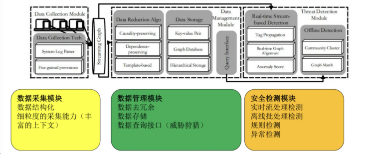

# 基于eBPF的容器异常检测Agent

## 背景

云原生时代（Cloud-Native Era）是近年来随着云计算技术的普及和发展而兴起的。随着企业和开发者越来越多地采用云原生架构和技术，如容器化（Containers）、微服务架构（Microservices）等，软件开发和部署的方式发生了显著的变革。但是，系统的复杂性和分布式特点也带来了巨大的挑战。主要存在两方面挑战：
- 安全性挑战：随着应用程序和服务越来越多地部署在云端，保护这些资源免受攻击变得尤为重要。云原生环境的安全策略需要不断更新，以应对新出现的威胁。
- 管理性挑战：云原生应用往往运行在分布式环境中，由多个不同的微服务、数据库、第三方API等组成，云原生环境需要有效管理大量的微服务，确保它们之间的有效通信和协同工作。
   
在云原生时代，系统的复杂性和分布式特点带来了巨大的挑战，而可观测性已经成为运维和开发人员确保系统可靠性和性能的关键手段。通过先进的可观测性工具，团队能够更好地了解系统的运行状态，快速定位问题并优化系统性能。

## 项目目标
本Agent云原生监控观测工具旨在解决云原生观测中的典型问题：
- 架构监控和整合难：微服务架构导致监控和故障排查困难，传统工具整合应用和基础架构指标较为困难。
- 数据分析和处理差：Kubernetes等环境中数据量大，分析效果差，传统工具处理数据一致性和故障转移的能力差。
- 资源响应和集成弱：普通开源监控工具在处理大规模集群会遇到性能瓶颈，对资源响应与集成能力较弱。

## 系统设计
### 功能框架
Agent是一个基于eBPF的轻量级高性能云原生监控程序，使用C/C++开发，旨在提供全生命周期监控解决方案。拥有以下设计优势：
- 架构可扩展与可兼容：提供网络API，核心框架高度可扩展。支持多种ebpf追踪点，架构兼容性显著提升。
- 数据可视化与轻量即用：拥有网络可视化、安全告警、一键部署功能。静态编译二进制仅60MB，单一二进制或镜像分发，支持多种输出格式。
- 资源集成与性能优化：可集成Prometheus和Grafana资源。通过eBPF自动收集容器和k8s元信息进行性能优化。

云原生监控系统分为四个核心层次：展示层、告警层、采集层和容器层。
- 展示层:负责前端展示和前后端通信。
- 告警层:负责处理告警和分析系统行为。
- 采集层:采集数据并统一数据格式。
- 容器层:监控容器环境和实现自动化部署。


### 功能亮点
Agent云原生监控观测工具具体有如下功能亮点，具体实现参照下方架构图
- 热更新:允许在不中断服务的情况下，动态地通过网络接口 API 启停特定的 ebpf 跟踪器。
- 可扩展:核心框架高度模块化可扩展，提高了系统的灵活性，还降低了维护升级的复杂性，可以轻松接入其他的 ebpf 程序。
- 轻量化:避免了复杂环境配置，能够在极小的内存占用下启动。
- 高性能:在内核层面实现数据过滤、聚合等工作,减少了向用户空间发送的数据量。系统采用C/C++编写，CPU使用率不超过5%


### 功能实现
参照上方的功能构图，整个Agent云原生监控观测工具功能的数据流向分为三部分：
- 数据采集：系统通过libbpf库与内核交互，收集网络(net)、进程(process)等数据。这些数据可以以json或csv格式存储。
- 数据处理：系统通过Analyzer模块对数据进行分析处理，生成告警信息。
- 数据展示：通过grafana对收集到的数据和告警信息进行展示。
通过从分层的数据流动，结合具体的功能模块，实现监控观测功能。

整个Agent云原生监控观测工具的检测框架基于白应用识别方案和数据检测方案。

白应用识别方案简述为三部分，具体流程分为五个阶段，如下图所示：
- 白应用的特征提取：比如文件的所有者,文件的签名信息,文件的威胁情报信息,进程的行为信息,进程的活跃程度等特征
- 分类阶段：根据提取到的特征对文件是否属于白应用进行置信度评估(打分),生成本地应用白名单
- 本地白名单共享：共享各个agent的应用白名单,利用投票机制生成全局白名单


数据检测方案是基于终端自适应画像的异常检测技术，将数据抽象为图结构进行存储和匹配，然后再进行相应的采集，管理与告警。如下图所示：


## 技术说明
Agent云原生监控观测工具主要使用了如下技术栈：
- BCC是一个用于创建高效的内核追踪和操作程序的工具包，包括多个有用的工具和示例。它利用了扩展的 BPF（Berkeley Packet Filters），正式称为 eBPF，这是首次添加到 Linux 3.15 中的一个新特性。BCC 使用的许多功能需要 Linux 4.1 及更高版本。
- libbpf是一个专注于 BPF（Berkeley Packet Filter）程序开发的库，它提供了一套易于使用的 API 来编译、加载、操作及管理内核中的 BPF 对象。这个项目是构建在 Linux 系统上使用 BPF 技术的核心组件，适用于性能监控、网络过滤、系统跟踪等多种场景。
- Prometheus作为生态圈 Cloud Native Computing Foundation（简称：CNCF）中的重要一员,其活跃度仅次于 Kubernetes, 现已广泛用于 Kubernetes 集群的监控系统中。
- eunomia是一个使用 C/C++ 开发的基于 eBPF的轻量级，高性能云原生监控工具框架，旨在帮助用户了解容器的各项行为、监控可疑的容器安全事件，力求提供覆盖容器全生命周期的轻量级开源监控解决方案。

团队长期聚焦在终端异常检测方向，具备一定技术积累。本项目使用到的异常检测方法是基于终端自适应画像的异常检测技术在容器工作负载和eBPF采集技术上的扩展，该技术目前已适配linux和windows平台，相关成果发表在领域顶级会议。首先从工业界实际场景应用的角度识别出现有异常检测工具客户端占用高、告警数量和图规模难以平衡以及服务端内存占用高的三大技术瓶颈，该工作发表在ACM CCS 2023[1]（CCF-A类 信息安全顶级会议）。其次，团队在国际上首次提出通过分布式架构设计，解决了终端溯源图检测成本高的难题，系统中有机结合了全局模型、告警聚合、告警语义相似和告警打分和大模型等方法的告警过滤方法，突破了异常检测方法面临的告警疲劳问题，该工作发表在USENIX Security 2023[2]（CCF-A类 信息安全顶级会议）和NDSS 2024[3]（CCF-A类 信息安全顶级会议）.

基于终端自适应画像的异常检测技术不仅获得学术界认可，也在实际场景中得到广泛的应用，产生较大价值。原型系统在1130台实验室终端集群上检测效果不低于现有方法的情况下，检测成本降低56倍，在某企业2w+台终端上检测出900+真实攻击。告警降噪技术在国内某头部家电和某头部物流企业真实告警数据上达到95%以上的降噪率和99%以上的降噪准确率。相关技术以《基于自适应画像的异构终端安全检测技术》入选华为OpenHarmony TSC年度课题，并进行汇报。

[1] Are we there yet? An Industrial Viewpoint on Provenance-based Endpoint Detection and Response Tools[C]. The 30th ACM Conference on Computer and Communications Security (CCS) (ACM CCS 2023, CCF-A 信息安全四大顶会)

[2] DISTDET: A Cost-Effective Distributed Cyber Threat Detection System[C]. Proceedings of The 32th USENIX Security Symposium (USENIX Security 2023, CCF-A 信息安全四大顶会)

[3] NODLINK: An Online System for Fine-Grained APT Attack Detection and Investigation Network and Distributed System Security (NDSS) Symposium 2024(NDSS 2024, CCF-A 信息安全四大顶会)


## 使用场景

Agent适用于以下使用场景：
- 大规模容器化应用的监控和异常检测
- 云计算环境中的容器安全管理
- 容器化开发环境的性能调优和故障排查

## 功能列表

- 开箱即用：通过单一二进制文件或镜像分发，一次编译，到处运行。启动简单，包含多种 eBPF 工具和监测点，支持多种输出格式（json, csv等），并可保存到文件。
- 自动化元信息收集：通过 eBPF 自动收集容器相关元信息，并结合多种指标。
- 监控集成：支持集成 Prometheus 和 Grafana，提供监控可视化和预警平台；也可作为 OpenTelemetry 的 collector 使用。
- 自定义预警规则：可配置运行时安全预警规则，通过 Prometheus 实现监控告警。
- 进程行为收集：自动收集进程行为，并通过 seccomp/capability 进行限制。
- 远程控制：提供 HTTP API，实现 eBPF 跟踪器的热插拔、一键分发和热更新，可定制插件进行数据分析。
- 高度可扩展：核心框架易于集成其他 libbpf eBPF C 程序。
## 技术栈

Agent项目使用了以下技术、框架和库：
- Linux eBPF
- Grafana
- Python/Go（用于数据处理和算法实现）
- Docker/Kubernetes（用于容器环境）

## 安装编译指南

### 配置要求

在编译之前，确保您的 Kconfig 包含以下选项：
```
CONFIG_DEBUG_INFO_BTF=y 
CONFIG_DEBUG_INFO=y
```
建议的内核版本为 5.10 或更高。如果使用较旧的内核版本，可能需要安装额外的 BTF 信息。
### 使用预编译的二进制文件

您可以使用我们预编译的二进制文件（请参见最新发布版本）来启动 Agent 服务器：
```
sudo ./agent server
```
此命令将启用核心 eBPF 跟踪器，包括进程、TCP 和文件，同时启动安全引擎以检测潜在的安全问题。

您也可以使用 Agent 运行单个 eBPF 跟踪器，例如：
```
sudo ./agent run files
```
该命令将在默认间隔 3 秒内跟踪系统中所有文件的读取或写入，并输出结果：
```
[2024-08-02 14:15:11.688] [info] start agent...
[2024-08-02 14:15:11.688] [info] start ebpf tracker...
[2024-08-02 14:15:11.688] [info] start prometheus server...
[2024-08-02 14:15:11.688] [info] press 'Ctrl C' key to exit...
[2024-08-04 16:22:30.123] [info] pid    container_name reads  writes read_bytes write_bytes type   comm         filename
[2024-08-04 16:22:30.123] [info] 142326 ubuntu          0      1          0          1      R      postgres     oom_score_adj
[2024-08-04 16:22:30.123] [info]   5824 ubuntu          1      0         16          0      R      code         state.vscdb
[2024-08-04 16:22:30.123] [info]   5453 ubuntu          1      0         16          0      R      grafana-server grafana.db
[2024-08-04 16:22:30.123] [info] 142327 ubuntu          1      0         18          0      R      git          .gitignore
[2024-08-04 16:22:30.123] [info] 142327 ubuntu          1      0         18          0      R      git          .gitignore
[2024-08-04 16:22:30.123] [info] 142327 ubuntu          1      0         18          0      R      git          .gitignore
[2024-08-04 16:22:30.123] [info]   5824 ubuntu          1      1          8         12      R      code         state.vscdb-journal
```
### 在Linux上编译

请按照以下步骤安装和设置Agent项目：
1. 克隆仓库：

```
# 使用docker进行部署
docker build -t agent-test .
docker run -it --rm agent-test /bin/bash

# code init
git clone https://gitlink.org.cn/p4zt3ZfhkI/jyedrqycjc.git && cd jyedrqycjc
git submodule update --init --recursive

# gitlink的子模块貌似无法更新 请自行去子目录更新
```
2. 编译部署Agent：

```
# dependencies
make install-deps

# bpf headers
make generate-tools

# cmake configure
CC=gcc-10 CXX=g++-10 cmake -Bbuild -Dagent_ENABLE_UNIT_TESTING=0 -Dagent_USE_GTEST=0

# 首先创建一个名为 build/libbpf/ 的目录，然后将 bpftools/process/.output/libbpf/ 目录中的 libbpf.a 文件复制到新创建的目录中
mkdir -p build/libbpf/ && cp bpftools/process/.output/libbpf/libbpf.a build/libbpf/libbpf.a

# 在指定的 build 目录中构建项目
cmake --build build --config Release
```
### 使用 Docker 部署 Prometheus 和 Grafana

#### 快速启动

1. 构建并运行Agent Docker镜像：
```
sudo docker build -t agent:v0.1 .
sudo docker run agent:v0.1
```
#### 部署 Prometheus
1. 拉取 Prometheus 镜像：
```
sudo docker pull prom/prometheus
```
2. 配置 Prometheus：
```
cp ./prometheus.yml /etc/prometheus/prometheus.yml
```
3. 运行 Prometheus 容器：
```
sudo docker run -d --user root -p 9090:9090 -v /etc/prometheus/prometheus.yml:/etc/prometheus/prometheus.yml -v /etc/prometheus/data:/data/prometheus prom/prometheus --config.file="/etc/prometheus/prometheus.yml" --web.listen-address="0.0.0.0:9090"
```
#### 部署 Grafana

1. 拉取 Grafana 镜像：
```
sudo docker pull grafana/grafana:latest
```
2. 运行 Grafana 容器：
```
sudo docker run -d -p 3000:3000 --name=grafana grafana/grafana:latest
# or on ubuntu
sudo apt-get install -y adduser libfontconfig1
wget https://dl.grafana.com/enterprise/release/grafana-enterprise_8.5.4_amd64.deb
sudo dpkg -i grafana-enterprise_8.5.4_amd64.deb
sudo /bin/systemctl start grafana-server
```
### Prometheus和Grafana运行结果

在 Promtheus 上展示和容器信息关联的 tcp 连接延时


对于容器中进程的跟踪结果，记录开始和结束时间

grafana dashboard: tcp files syscall 每分钟计数统计图


## 设计文档

[系统框架与ebpf探针设计](docs/系统框架与ebpf探针设计.pdf)

[容器追踪模块设计](docs/容器追踪模块设计.pdf)

## 兼容性

Agent支持以下操作系统和环境：
- Linux
- Docker/Kubernetes

## 依赖关系

项目运行所需的依赖项包括：
- Linux内核版本 >= 4.18（支持eBPF）
- Python/Go（用于算法实现）
- Prometheus/Grafana（用于数据展示）

## Benchmark

为了评估Agent的性能，我们使用了以下基准测试方法：

### 使用 top 查看内存和CPU占用情况

通过 top 命令查看系统在运行Agent时的内存和CPU占用情况。


### 环境设置

在本机上使用 OpenResty 和 APISIX 启动一个包含6个容器和负载均衡的网络服务，使用 Prometheus 和 Grafana 进行监控，并使用 wrk 进行压力测试。

测试环境配置如下：
- 操作系统：Linux ubuntu 5.13.0-44-generic #49~20.04.1-Ubuntu SMP x86_64 GNU/Linux
- 硬件配置：4 核 CPU，12 GB 内存

### 测试过程

#### 未开启Agent的情况

首先，在未启动Agent的情况下进行测试，获得基线性能数据：


#### 启动Agent后的情况

接下来，启动Agent，并启用默认配置中的 process/container、tcp、files、ipc 等探针，在相同的环境下再次进行测试：


### 结果分析

可以观测到，启动Agent之后，服务的性能损耗仅约为 3-4%。这表明，Agent在提供全面监控和安全检测的同时，对系统资源的占用非常低，不会显著影响系统的整体性能。

### 代码量
| Language          | Files | Blank | Comment | Code    |
|-------------------|-------|-------|---------|---------|
| C/C++ Header      | 203   | 45316 | 10137   | 295535  |
| C                 | 64    | 1542  | 673     | 9129    |
| SVG               | 2     | 46    | 4       | 6486    |
| Markdown          | 39    | 2095  | 0       | 6150    |
| C++               | 50    | 480   | 217     | 4113    |
| make              | 29    | 491   | 528     | 1688    |
| INI               | 1     | 264   | 0       | 914     |
| CMake             | 13    | 180   | 172     | 791     |
| Go                | 2     | 39    | 181     | 760     |
| Rust              | 3     | 39    | 8       | 404     |
| JSON              | 3     | 0     | 0       | 235     |
| TOML              | 4     | 24    | 0       | 99      |
| YAML              | 4     | 13    | 16      | 72      |
| Dockerfile        | 2     | 15    | 6       | 70      |
| Bourne Shell      | 2     | 8     | 24      | 39      |
| reStructuredText  | 1     | 5     | 0       | 22      |
| **SUM**              | 422   | 50557 | 11966   | 326507  |    
## 项目成果

### 2024年 第一届中国研究生操作系统开源创新大赛

进入决赛并获得三等奖：


### 2024年 OpenHarmony 纯净安全挑战方向华科代表项目
